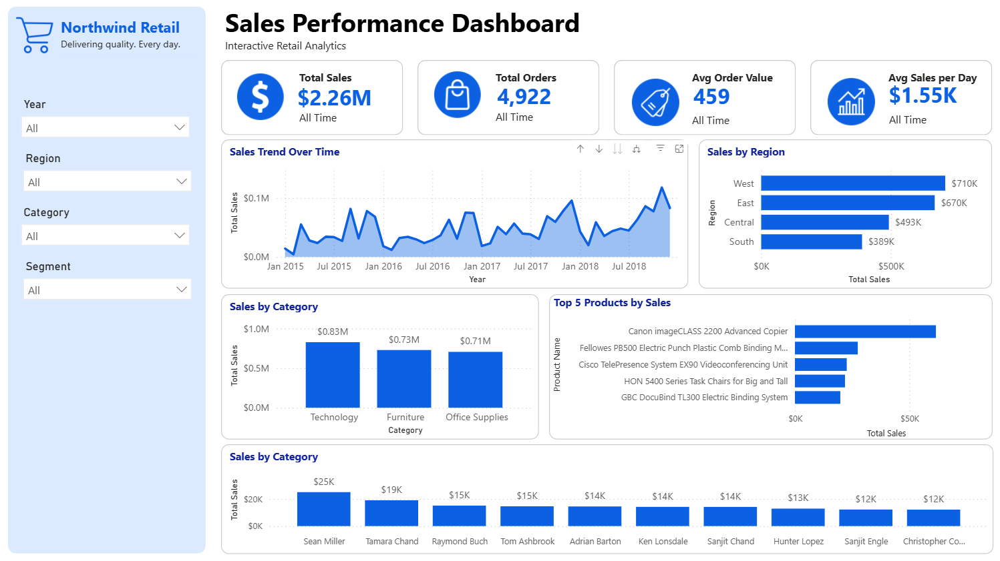
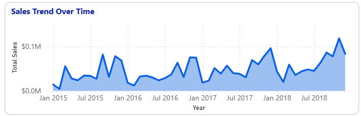
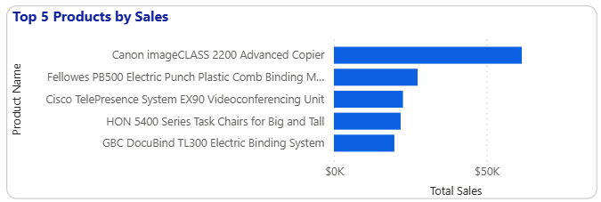
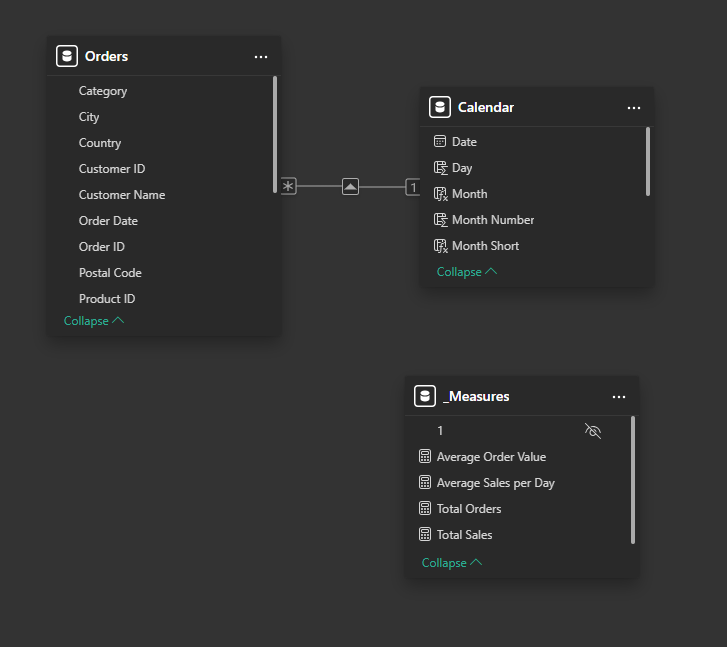

# 📊 Superstore Sales Performance Dashboard

An interactive **Sales Performance Dashboard** built with **Microsoft Power BI** to analyze retail sales performance using the **Sample Superstore** dataset.

This project demonstrates data modeling, Power Query transformations, DAX calculations, and dashboard design following Power BI best practices.

---

## 📸 Dashboard Preview

Interactive dashboard built using Microsoft Power BI.

### Sales Trend

### Top Products

---

## 📌 Project Overview

This interactive Power BI dashboard provides business users with a comprehensive view of retail sales performance across different regions, customer segments, product categories, and time periods.

It was designed to help decision-makers monitor sales performance, identify trends, evaluate regional performance, and discover high-performing products and customers through interactive visualizations.

### Business Questions Answered

- 💰 How much revenue was generated?
- 📦 How many orders were placed?
- 📈 How are sales trending over time?
- 🌎 Which regions perform best?
- 🛍 Which products generate the highest sales?
- 👥 Who are the top customers?

---

## 🎯 Business Objectives

This dashboard was developed to help decision-makers:

- Monitor overall sales performance
- Identify top-performing products and customers
- Compare sales across regions and categories
- Analyze sales trends over time
- Support data-driven business decisions

---

## ✨ Features

### Executive KPIs

- Total Sales
- Total Orders
- Average Order Value
- Average Sales per Day

### Interactive Visualizations

- Monthly Sales Trend
- Sales by Category
- Sales by Region
- Top 10 Products
- Top 10 Customers

### Interactive Filters

- Year
- Region
- Category
- Segment

---

## 🏗 Data Model

The report follows a simple star-schema approach.

### Tables

- Orders (Fact Table)
- Calendar (Date Dimension)
- _Measures (DAX Measures)

Data model:

---

## 🧮 DAX Measures

The dashboard uses custom DAX measures including:

- Total Sales
- Total Orders
- Average Order Value
- Average Sales per Day

See the complete formulas here:

📄 [Documentation/dax-measures.md](Documentation/dax-measures.md)

---

## ⚙ Power Query Transformations

Data preparation includes:

- Data type validation
- Date conversion
- Calendar table creation
- Data quality checks
- Model relationship creation

---

## 🎨 Dashboard Design

Design principles used:

- Clean executive layout
- Microsoft Fluent-inspired color palette
- Responsive spacing
- Consistent KPI cards
- Interactive slicers

Documentation:

📄 [Documentation/dashboard-design.md](Documentation/dashboard-design.md)

---

## 🛠 Built With

| Tool | Purpose |
|------|---------|
| Microsoft Power BI Desktop | Dashboard Development |
| Power Query | Data Cleaning & Transformation |
| DAX | Business Calculations |
| GitHub | Version Control & Portfolio |

---

## 📂 Dataset

This project uses the publicly available **Sample Superstore** dataset.

The dataset is **not included** in this repository to respect the original author's distribution terms.

Please download the dataset from its original source and place it inside the `Dataset` folder before opening the Power BI report.

Dataset Source:

- [Sales Forecasting Dataset by Rohit Sahoo (Kaggle)](https://www.kaggle.com/datasets/rohitsahoo/sales-forecasting)

---

## 🚀 Future Improvements

Planned enhancements include:

- Drill-through pages
- Bookmarks and navigation
- Tooltip pages
- Mobile-optimized layout
- Custom Power BI visual (.pbiviz)
- Additional business KPIs

---

## 👨‍💻 Author

**Jomar Pajenago**

Aspiring Data Analyst passionate about Business Intelligence, Data Visualization, SQL, and Process Automation.

- GitHub: [jhievalie](https://github.com/jhievalie)
- LinkedIn: [Jomar Pajenago](https://www.linkedin.com/in/jomarp21/)

---

⭐ If you found this project useful or interesting, consider giving it a star on GitHub.

Made with ❤️ using Microsoft Power BI, DAX, and Power Query.
